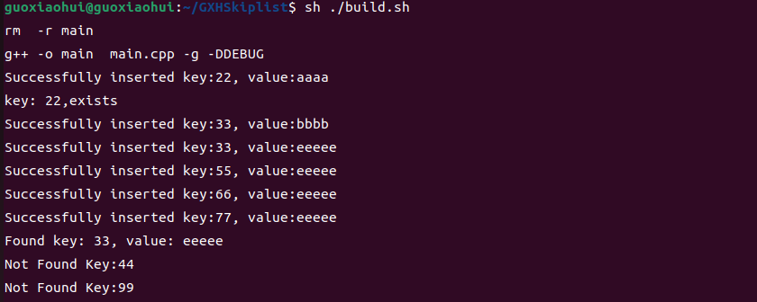

## 项目简介
-----
本项目是再学习完C++和Redis数据库之后进行的一个总结练习项目，是对于Carl老师https://github.com/youngyangyang04/Skiplist-CPP  跳表项目的学习，本文在源码中进行了详细的注解，可以更方便清晰的了解跳表的实现思路。对于数据库我们都了解基于关系型数据库mysql，以及非关系型数据库redis，redis是一种内存数据库，数据存储在内存中，可以用于热点数据的存储，可以应对高并发的各种场景，再redis中，有一种数据格式叫做zset，它的底层实现是 skiplist(快表) + packlist(紧凑列表),本项目是对于快表这个数据结构的源码的简单认识与了解。

## KV存储模型
------
redis是一个KV存储模型，本项目就是基于跳表实现的轻量级键值型存储引擎，使用C++实现。具体实现的功能有：插入元素、删除元素、查询元素、数据展示、数据存储硬盘、从硬盘读取数据等。

## 项目中文件
----
README.md  项目中文文档

main.cpp 包含对于跳表各种功能的简单使用

skiplist.h 跳表的主要实现类

store  数据存储到硬盘的路径

makefile  编译脚本

build.sh  自动化编译与清除编译文件

press-test.cpp 压力测试文件

stress-test-start.sh 压力测试脚本

## 实现功能
----
- insert_element   添加数据

- display_list     展示数据

- search_element   查询数据

- delete_element   删除数据

- dump_file        数据落盘  
 
- load_file        加载数据

- size             返回数据规模

## 功能展示
-----
- 添加数据

- 展示数据

- 查询数据

- 删除数据

- 数据落盘  
 
 
- 加载数据


## 压力测试
--------
> 测试环境 ubutun22.04.2 LTS 12G内存
### demo
---
- 不带日志

- 带日志


> 主要测试了添加数据和查询数据的测试
>
> 测试数据的次数分别为100000，500000，1000000
> 
> 测试功能还区别了带日志显示和不带日志显示的性能区别
> 
> 跳表数高：18
### 插入数据
---
- 不带日志

|插入数据规模|耗时（s）|
|-|-|
|100000|0.0984336|
|500000|0.800351 |
|1000000|1.97998|

- 带日志

|插入数据规模|耗时（s）|
|-|-|
|100000|0.96305|
|500000|6.78236|
|1000000|13.0647|

不带日志情况下，每秒可处理写请求数（QPS）：62.47W

带日志情况下，每秒可处理写请求数（QPS）：7.37w
### 查询数据
---
- 不带日志

|插入数据规模|耗时（s）|
|-|-|
|100000|0.108277|
|500000|0.842614|
|1000000|2.42431|

- 带日志

|插入数据规模|耗时（s）|
|-|-|
|100000|0.833022|
|500000|5.95011|
|1000000|12.1562|

不带日志情况下，每秒可处理读请求数（QPS）：59.33W

带日志情况下，每秒可处理读请求数（QPS）：8.4w

## 快速运行
----
1.功能检测
```shell
- 方法一
make clean
make main
./main

- 方法二
sh ./build.sh
```

2.性能测试
```
- 方法一
make cleanp
make press
./press_test

- 方法二
sh ./press_test.sh
```

## 优化
基于carl老师的一些遗留问题，再delete的时候及时释放了内存，压力测试可以通过shell文件进行调整执行次数自动化进行

## 待优化
- 可以基于这个项目的功能作为服务器提供的基础服务，加入多路复用，定时器，I/O多路复用技术，多线程解决I/O加入任务队列，主线程负责查询读写（因为redis底层就是单线程实现数据管理，多线程只负责I/O的，保证数据的安全，并且还能充分利用多线程的CPU资源优势），类似与一个只是实现了字符串KV格式的微型redis服务器，然后通过多个客户端去读取数据，存储数据。（提示：redis底层对于字符串数据结构的存储是采用的SDS动态字符串，它提前记录了每个字符串的lenth属性，可以以O(1)的时间复杂度来获取字符串长度，对于一定长度的zset才是采取的skiplist跳表的数据结构）
